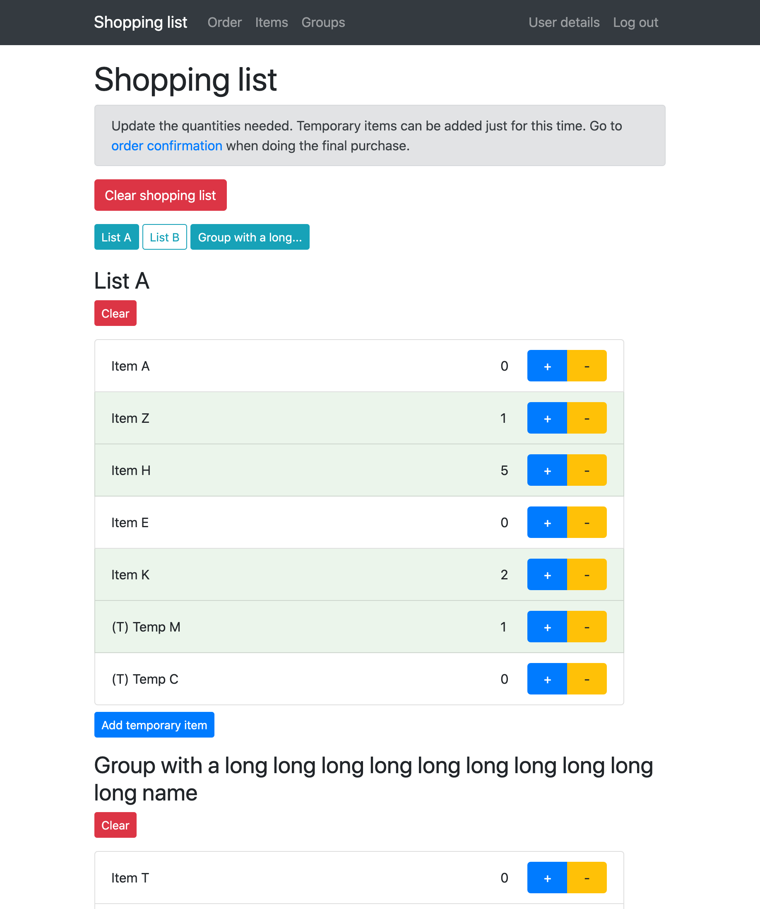
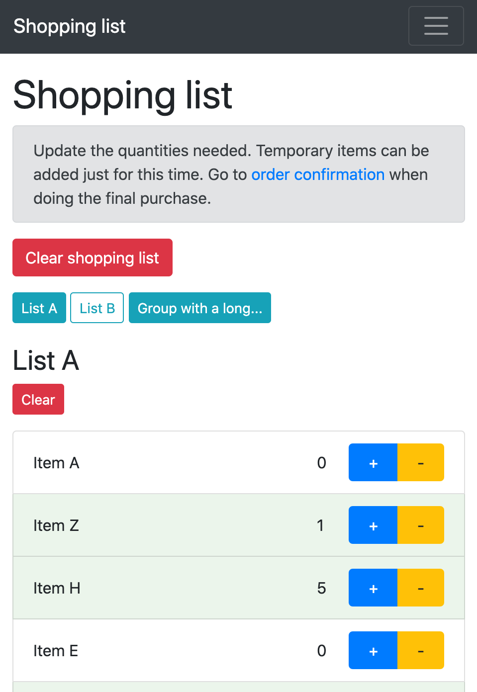
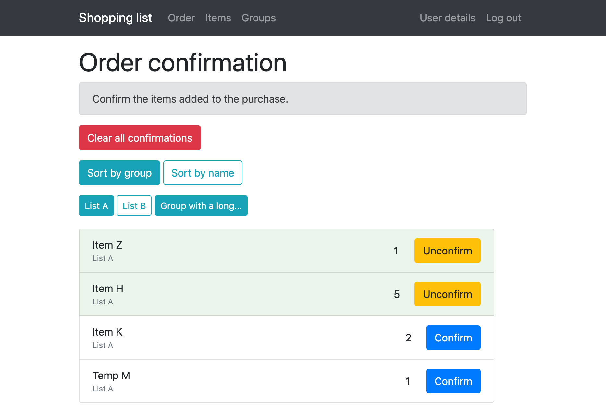
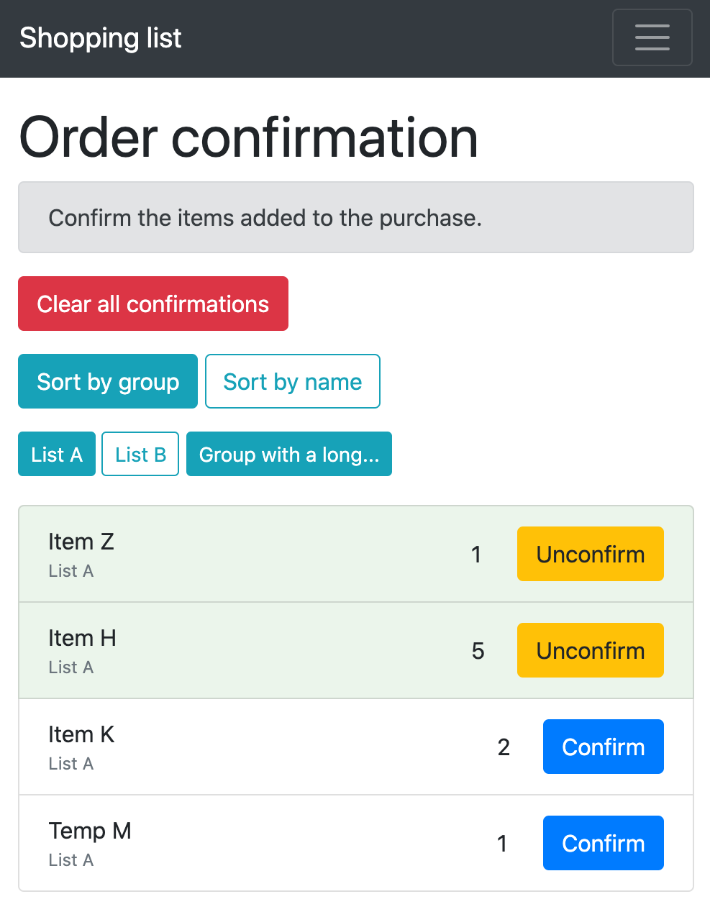
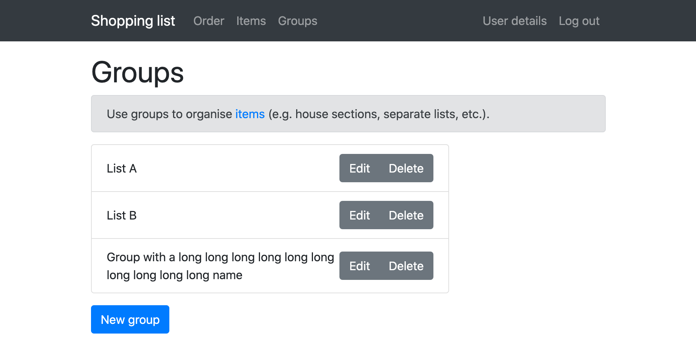
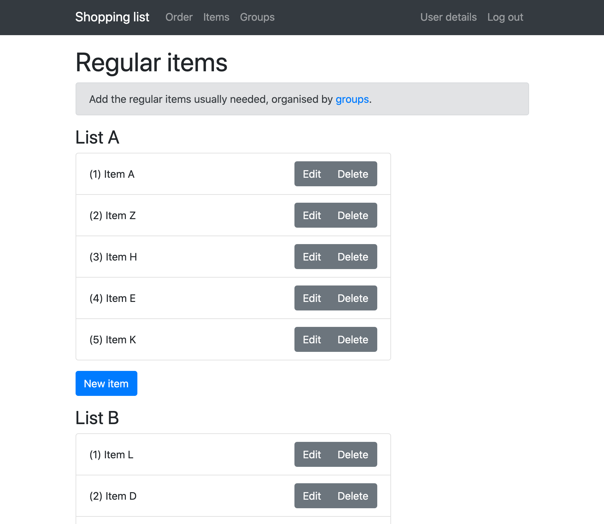

# Shopping list app
This is a simple application to manage a shopping list with the usual things to buy.

# Users
There's no registration process. Users need to be created manually:

    User.create!(email: '[email]', password: '[password]]')

When logged in, users can change the email and password on the user details page.

Registration and password recovery are not implemented at the moment.

## Groups 
Groups are used to organise items. They can be a section of the house (bathroom, kitchen, etc.), separate lists (home, work, etc.), or any other grouping preference.
They will be used to group items and filtering.

## Items
These are the regular items to have on the shopping list.

## Shopping list
Shows all items organised by group and allows quantities to be updated.
Regular items are always there. Temporary items can be added and will be removed if the list is cleared.
Groups can be filtered so that only items from certain groups are shown.

The purpose of the shopping list is to update quantities on the needed items.

## Order
Order confirmation only shows the items with quantity bigger than zero.
Items can be sorted by group or name.
Groups can be filtered so that only items from certain groups are shown.

The purpose of order confirmation is to confirm items when the purchase is being made and they are added to a physical or online shopping cart.

## Screenshots
 
 

## Technical stuff
This is a rails app, using PostgreSQL for the database, devise for authentication and bootstrap for the layout.
